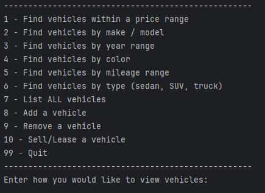
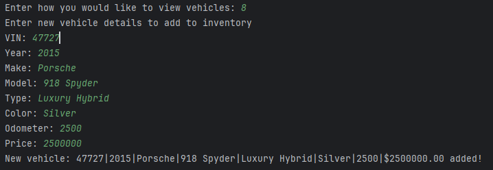
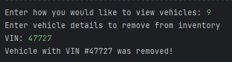
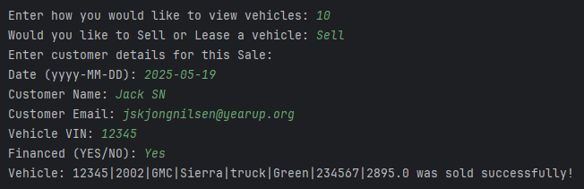

# 🚗 Car Dealership Console App (JDBC Edition)

A Java-based **console application** that simulates a car dealership system with a functional interface for managing vehicle inventory, customer transactions, and storing contract records in a **MySQL database** using JDBC. This project demonstrates principles of **object-oriented design** and **database-driven persistence**.

> 🔗 Previous CarDealership GitHub Repo: [CarDealership](https://github.com/Jskjongn/CarDealership)

---

## 🧩 Overview

This console-based application allows dealership employees to:

- 🔍 **Search Vehicles** by:
    - Price range
    - Make/Model
    - Year range
    - Color
    - Mileage range
    - Type (Car, Truck, SUV, Van)
- 📃 **List All Vehicles**
- ➕ **Add a New Vehicle**
- 🗑️ **Remove a Vehicle**
- 💳 **Sell or Lease Vehicles** (with contract generation)
- 👋 **Quit the Application**

---

## ✨ Key Features

### 🔧 Inventory Management
- Browse and filter vehicles based on dynamic search criteria.
- Add or remove vehicles directly via database interaction.

### 💼 Sales & Lease Contracts
- Automatically compute sale/lease prices.
- Store contract data in separate **MySQL tables**:
    - `sales_contracts`
    - `lease_contracts`
- Enforce business rules:
    - Financing rules based on price and duration

### 🧑‍💻 User Interaction
- Console prompts guide employees through search, sale, and lease workflows.
- Real-time payment and financing estimates.

---

## 🗃️ Data Persistence (MySQL)

Instead of using `.csv` files, this project stores all data in a **MySQL database**.

- Vehicle data is loaded via `VehicleDao`
- Contracts are saved through `SalesDao` and `LeaseDao`
- All CRUD operations are performed using **JDBC with BasicDataSource**

---

## 📁 Project Structure
```
📦 jdbc-dealership-project
├── 📁 .idea
├── 📁 src
│   └── 📁 main
│       └── 📁 java
│           └── 📁 com.pluralsight.dealership
│               ├── 📁 dao
│               │   ├── DealershipDao.java
│               │   ├── InventoryDao.java
│               │   ├── LeaseContractDao.java
│               │   ├── SalesContractDao.java
│               │   └── VehicleDao.java
│               ├── 📁 models
│               │   ├── Contract.java
│               │   ├── Dealership.java
│               │   ├── LeaseContract.java
│               │   ├── SalesContract.java
│               │   └── Vehicle.java
│               ├── 📁 ui
│               │   └── UserInterface.java
│               └── App.java
├── 📁 test
├── 📁 target
├── 📄 .gitignore
├── 📄 CarDealershipDatabase.sql
├── 📄 pom.xml
└── 📄 README.md
```

## 🖼️ Screenshots
### 🏠 Home Screen



### 🚗 Adding Vehicle


### 🚗 Removing Vehicle


### 💳 Sell/Lease Vehicle
